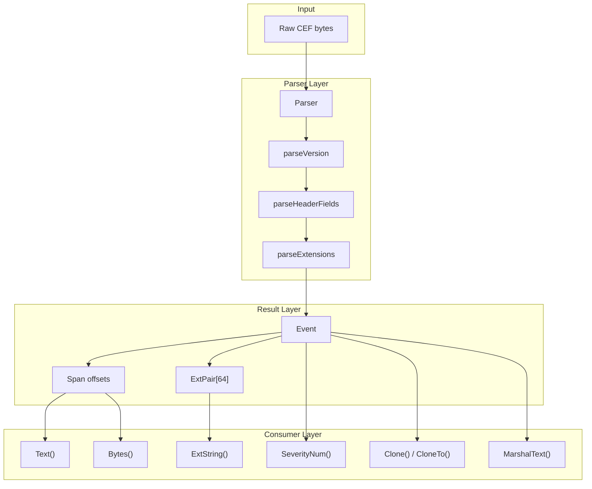

# go-cef

> A zero-allocation CEF (Common Event Format) parser for Go.

[](https://golang.org)
[](https://pkg.go.dev/github.com/ubyte-source/go-cef)
[](https://opensource.org/licenses/Apache-2.0)
[](go.mod)

## 🏗 Architecture Overview



## ✨ Key Features

- 🚀 **Zero Allocations** — all fields are `Span` (offset pairs) into the original buffer — no copies on the hot path
- 🧱 **Pure Go** — no external dependencies, no code generation, no cgo
- 📋 **Spec-Compliant** — tested against every rule and example from the CEF v26 specification
- 🛡️ **DoS-Resistant** — bounded scanning budgets, max key length, input size limits
- 🏭 **Multi-Vendor** — tested with 35+ vendor products from Cisco, Check Point, Palo Alto, and more
- 🩹 **BestEffort Mode** — returns partial results for malformed input
- 🔩 **Concrete Types** — `*Parser` and `*Event` are exported structs, no interfaces
- 🧬 **Fuzz-Tested** — continuous Go native fuzzing with 40+ seed corpus entries
- ⚔️ **Adversarial Benchmarks** — pathological inputs benchmarked, no O(n²) degradation

## 🚀 Quick Start

### 📦 Installation

```bash
go get github.com/ubyte-source/go-cef
```

Requires **Go 1.25+**.

### 💡 Basic Usage

```go
package main

import (
    "fmt"
    "github.com/ubyte-source/go-cef"
)

func main() {
    p := cef.NewParser()
    input := []byte(`CEF:0|Security|ThreatManager|1.0|100|worm successfully stopped|10|src=10.0.0.1 dst=2.1.2.2 spt=1232`)

    e, err := p.Parse(input)
    if err != nil {
        panic(err)
    }

    fmt.Println("Version:", e.Version)
    fmt.Println("Vendor:", e.Text(e.Vendor))
    fmt.Println("Product:", e.Text(e.Product))
    fmt.Println("Severity:", e.Text(e.Severity))

    level, _ := e.SeverityLevel()
    fmt.Println("Severity Level:", level)

    // Zero-alloc extension lookup
    if src, ok := e.ExtString("src"); ok {
        fmt.Println("Source IP:", e.Text(src))
    }
}
```

## 🩹 BestEffort Mode

```go
p := cef.NewParser(cef.WithBestEffort())
e, err := p.Parse(truncatedInput)
// e is non-nil even when err != nil — contains partial results
if e != nil {
    fmt.Println("Version:", e.Version)
}
```

## 🔓 Unescaping

The parser returns raw `Span`s that include escape sequences (e.g., `\|`, `\\`, `\=`, `\n`).
This is by design: zero-alloc parsing means no copies. When you need the unescaped value,
use the provided helpers:

```go
// Header fields: \| → |, \\ → \
name := string(cef.UnescapeHeader(e.Bytes(e.Name), nil))

// Extension values: \= → =, \\ → \, \n → newline, \r → CR
if span, ok := e.ExtString("msg"); ok {
    msg := string(cef.UnescapeExtValue(e.Bytes(span), nil))
    fmt.Println(msg)
}

// Zero-alloc with caller-provided buffer:
dst := make([]byte, 0, 256)
dst = cef.UnescapeExtValue(e.Bytes(span), dst)
```

## 📌 Retaining Results

The `*Event` returned by `Parse` is reused on the next call on the same `Parser`.
To retain a result beyond the next parse call, clone it:

```go
e, _ := p.Parse(input)
saved := e.Clone() // deep copy — independent of the Parser and original buffer
```

For high-throughput pipelines, use `CloneTo` with a `sync.Pool` for zero allocations after warmup:

```go
e, _ := p.Parse(input)
dst := pool.Get().(*cef.Event)
e.CloneTo(dst)
process(dst)
pool.Put(dst)
```

`Clone` allocates a compact buffer covering only the referenced byte range, not the entire original input.

## 📖 API Reference

See the [package documentation](https://pkg.go.dev/github.com/ubyte-source/go-cef) for the full API.

### Parser

| Function | Description |
|----------|-------------|
| `NewParser(opts ...ParserOption) *Parser` | Create a reusable parser |
| `(*Parser).Parse([]byte) (*Event, error)` | Parse a CEF message (zero-alloc) |
| `WithBestEffort() ParserOption` | Return partial results on error |
| `WithMaxExtensions(int) ParserOption` | Limit extension count |

### Event Access (zero-alloc)

| Method | Description |
|--------|-------------|
| `(*Event).Bytes(Span) []byte` | Raw bytes for a span |
| `(*Event).Text(Span) string` | String for a span |
| `(*Event).Ext([]byte) (Span, bool)` | Extension lookup by `[]byte` key |
| `(*Event).ExtString(string) (Span, bool)` | Extension lookup by `string` key (preferred) |
| `(*Event).ExtAt(int) (ExtPair, bool)` | Extension by index |
| `(*Event).All() iter.Seq2[Span, Span]` | Iterator over extensions (allocates; prefer ExtAt for zero-alloc) |
| `(*Event).Valid() bool` | True if header is complete |
| `(*Event).SeverityNum() (int, bool)` | Numeric severity (0–10) |
| `(*Event).SeverityLevel() (string, bool)` | Named level (Low/Medium/High/Very-High) |

### Cloning

| Method | Description |
|--------|-------------|
| `(*Event).Clone() *Event` | Deep copy (one allocation) |
| `(*Event).CloneTo(*Event) *Event` | Copy into existing Event (zero-alloc after warmup) |

### Serialization

| Method | Description |
|--------|-------------|
| `(*Event).MarshalText() ([]byte, error)` | `encoding.TextMarshaler` |
| `(*Event).AppendText([]byte) ([]byte, error)` | `encoding.TextAppender` (zero-alloc with pre-allocated buffer) |
| `(*Event).UnmarshalText([]byte) error` | `encoding.TextUnmarshaler` |

### Unescape Helpers

| Function | Description |
|----------|-------------|
| `UnescapeHeader(raw, dst []byte) []byte` | Unescape header field (`\|`, `\\`) |
| `UnescapeExtValue(raw, dst []byte) []byte` | Unescape ext value (`\=`, `\\`, `\n`, `\r`) |

### Errors

| Error | Description |
|-------|-------------|
| `ParseError` | Positional error with `Unwrap()` for `errors.Is` |
| `ErrEmpty` | Empty input |
| `ErrPrefix` | Missing `CEF:` prefix |
| `ErrVersion` | Invalid version number |
| `ErrIncompleteHeader` | Missing header pipe delimiters |
| `ErrExtKey` | Invalid extension key |
| `ErrExtOverflow` | Too many extensions |
| `ErrInputTooLarge` | Input exceeds 4 GiB |

## ⚡ Benchmarks

Run with:
```bash
make bench
```

Target: **0 allocs/op** on all successful parse benchmarks, **>400 MB/s** throughput (typically 600–900 MB/s).
Error paths allocate one `ParseError` (24 bytes) per call.

## 🧪 Testing

```bash
make test        # All tests with race detector
make bench       # Benchmarks with memory profiling
make fuzz        # Native Go fuzzing (30s)
make cover       # Coverage report
make lint        # golangci-lint (25 linters, ultra-strict)
```

## 🏭 Tested Vendors

| Vendor | Product | Testdata |
|--------|---------|----------|
| ArcSight | SmartConnector (spec examples) | ✓ |
| AWS | Security Hub | ✓ |
| Barracuda | WAF, WAF (Azure Sentinel) | ✓ |
| Bitdefender | GravityZone | ✓ |
| Carbon Black | EDR | ✓ |
| Check Point | NGFW (Log Exporter) | ✓ |
| Cisco | Cyber Vision, ASA/Firepower | ✓ |
| Citrix | NetScaler | ✓ |
| CrowdStrike | Falcon | ✓ |
| CyberArk | PAS | ✓ |
| Darktrace | Enterprise | ✓ |
| F5 | BIG-IP | ✓ |
| FireEye/Trellix | NX, HX | ✓ |
| Forcepoint | NGFW, DLP | ✓ |
| Fortinet | FortiGate, FortiWeb | ✓ |
| Illumio | PCE | ✓ |
| Imperva | WAF | ✓ |
| Juniper | SRX | ✓ |
| McAfee/Trellix | ePO | ✓ |
| Microsoft | ATA, Windows (via NXLog) | ✓ |
| Palo Alto Networks | PAN-OS | ✓ |
| Proofpoint | TAP | ✓ |
| Qualys | Cloud Platform | ✓ |
| Radiflow | iSID | ✓ |
| Rapid7 | InsightIDR | ✓ |
| SentinelOne | Singularity | ✓ |
| Sophos | Central | ✓ |
| Splunk | UF | ✓ |
| Symantec | Endpoint Protection | ✓ |
| Trend Micro | Deep Security | ✓ |
| Vectra | Cognito | ✓ |
| Votiro | Cloud | ✓ |
| WatchGuard | Firebox | ✓ |
| WithSecure | EDR | ✓ |
| Zscaler | ZIA | ✓ |

## 🛡️ Security

The parser enforces bounds to prevent resource exhaustion:

| Parameter | Limit | Constant |
|-----------|-------|----------|
| Maximum extensions per event | 64 | `MaxExtensions` |
| Maximum extension key length | 63 bytes | `maxKeyLen` |
| Maximum `=` scanned per value | 256 | `maxEqualsScanned` |
| Maximum input size | 4 GiB | `math.MaxUint32` |

For security policy and vulnerability reporting, see [SECURITY.md](SECURITY.md).

## 📜 Specification

Based on: _"Implementing ArcSight Common Event Format (CEF) — Version 26"_
(OpenText, October 2023).

Supports CEF:0 (spec 0.1), CEF:1 (spec 1.x), and future versions.

## 🧠 Design Principles

1. **One type, one job.** `Parser` parses. `Event` contains. Clear responsibilities.
2. **The interface is the contract.** Same pattern as `go-syslog`: `Parser` + `Message` + `ParserOption`.
3. **Zero-alloc is a constraint, not a goal.** No allocations in the hot path — enforced by benchmarks.
4. **The parser eats everything.** If a device sends `CEF:`, we parse it.
5. **Errors as values, not surprises.** Position and reason in every error.

## 📁 Project Structure

```
go-cef/
├── cef.go              # Types: Parser, Event, Span, ExtPair, Clone, Marshal
├── parse.go            # Parse, parseVersion, parseHeaderFields, scanField
├── extensions.go       # Extension key=value parsing
├── unescape.go         # Unescape helpers for header and extension values
├── errors.go           # Error types with positional information
├── severity.go         # SeverityNum(), SeverityLevel()
├── doc.go              # Package documentation
├── .golangci.yml       # Ultra-strict linter config (25 linters)
├── Makefile            # Build, test, bench, fuzz, lint
├── CONTRIBUTING.md     # Contribution guidelines
├── SECURITY.md         # Security policy
└── LICENSE             # Apache 2.0
```

## 🤝 Contributing

Contributions are welcome. Please fork the repository, create a feature branch, and submit a pull request.

For contribution guidelines, see [CONTRIBUTING.md](CONTRIBUTING.md).

---

## 🔖 Versioning

We use [SemVer](https://semver.org/) for versioning. For available versions, see the [tags on this repository](https://github.com/ubyte-source/go-cef/tags).

---

## 👤 Authors

- **Paolo Fabris** — _Initial work_ — [ubyte.it](https://ubyte.it/)

See also the list of [contributors](https://github.com/ubyte-source/go-cef/contributors) who participated in this project.

## 📄 License

This project is licensed under the Apache License 2.0 — see the [LICENSE](LICENSE) file for details.

---

## ☕ Support This Project

If go-cef has been useful for your SIEM pipeline or security projects, consider supporting its development:

[](https://coff.ee/ubyte)

---

**Star this repository if you find it useful.**

For questions, issues, or contributions, visit our [GitHub repository](https://github.com/ubyte-source/go-cef).
